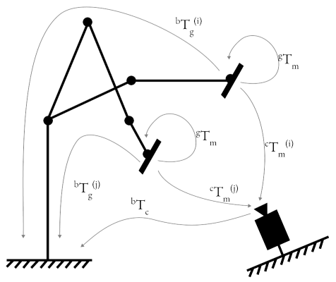
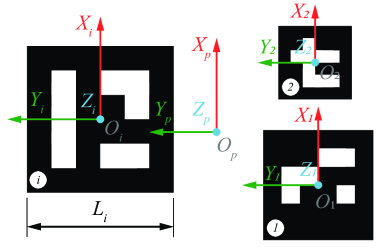

# Robot-Camera Calibration 

There are two types of robot-camera calibration:
* **eye-on-base**: camera is mounted on a fixed base
* **eye-on-hand**: camera is mounted on the robot

*Note: This work was part of [NIST Robotics Training Center project](https://cmu-mfi.github.io/rtc/). Original repo: [rtc_vision_toolbox](https://github.com/cmu-mfi/rtc_vision_toolbox)*

## Method: eye-on-base

| Known Value(s) | Collected Samples | Unknown Value(s) |
| --- | --- | --- |
| $^gT_m$ | $^bT_g^{(i)}, ^cT_m^{(i)}$ | $^bT_c$ |

Given a setup of camera on fixed base, the procedure to calibrate the robot-camera system is as follows:

1. Mount a marker on the robot end effector.
2. Estimate $^gT_m$, the transformation matrix marker to gripper. \ 
    This value is determined from CAD reference *(preferred)* or measuring the marker center from end effector frame. If using ArUco marker, the marker center is the origin of the marker frame.

3. Collect samples of $^bT_g^{(i)}$ and $^cT_m^{(i)}$. \
    Each sample is collected by moving the robot to a new pose and capturing the image of the marker. The pose of the marker in the image is used to estimate $^cT_m^{(i)}$. The pose of the robot end effector is used to estimate $^bT_g^{(i)}$.
4. Estimate $^bT_c$, the transformation matrix base to camera using suitable algorithm as discussed in [section below](#calibration-algorithms). Following are the inputs to solve $^bT_c$
> $^bT_m^{(i)} \mid i = 1...n$: Transformation matrix marker to robot base. $^bT_m^{(i)} = {^bT_g^{(i)}} \cdot {^gT_m} $ \
> $^cT_m^{(i)} \mid i = 1...n$: Transformation matrix marker to camera.

5. Validate the calibration by checking the reprojection error, $\epsilon$.\
$$\epsilon = \frac{1}{n} \cdot {\sum_{i=1}^{n}{\lVert (^bT_c \cdot {^cT_m^{(i)}}) [:,3] - (^bT_m^{(i)})[:,3]\rVert}}$$

## Method: eye-on-hand

| Known Value(s) | Collected Samples | Unknown Value(s) |
| --- | --- | --- |
| $^bT_{c'}$ | $^bT_g^{(i)}, ^cT_m^{(i)}$ | $^gT_c$ |

In this setup, we use one of the calibrated cameras fixed on base to calibrate a camera mounted on the robot end effector. The method is similar to eye-on-base calibration.

1. Put a marker such that it is fixed w.r.t. the robot base, and in view of both cameras ($c'$ and $c$).
2. Using the eye-on-base calibration, we get $^bT_m = {^bT_{c'}}\cdot{^{c'}T_m}$. The *eye-on-base* camera takes a picture of the marker and estimates $^{c'}T_m$.
3. Collect samples of $^bT_g^{(i)}$ and $^cT_m^{(i)}$. \
    Each sample is collected by moving the robot to a new pose and capturing the image of the marker. The pose of the marker in the image is used to estimate $^cT_m^{(i)}$. The pose of the robot end effector is used to estimate $^bT_g^{(i)}$.
4. Estimate $^gT_c$, the transformation matrix base to camera using suitable algorithm as discussed in [section below](#calibration-algorithms). Following are the inputs to solve $^gT_c$
> $^gT_m^{(i)} \mid i = 1...n$: Transformation matrix marker to robot gripper. $^gT_m^{(i)} = {(^bT_g^{(i)})^{-1}} \cdot {^bT_m} $ \
> $^cT_m^{(i)} \mid i = 1...n$: Transformation matrix marker to camera.

5. Validate the calibration by checking the reprojection error, $\epsilon$.\
$$\epsilon = \frac{1}{n} \cdot {\sum_{i=1}^{n}{\lVert (^gT_c \cdot {^cT_m^{(i)}}) [:,3] - (^gT_m^{(i)})[:,3]\rVert}}$$

---

## Code Overview

All the calibration related methods in above figure are in [`calibration/calibration.py`](/calibration/calibrations.py). \
To collect samples, `collect_data` method takes three class objects as input: `robot`, `camera`, and `marker`. Each new robot type, camera type, or marker type needs its own class. Use existing classes as examples to create a new one, if needed.

* `robot` classes are in [/robot folder](/robot)
* `camera` classes are in [/camera folder](/camera)
* `marker` classes are in [/calibration/marker folder](/calibration/marker)

**Usage**: Scripts, [`scripts/robot_camera_calibration.py`](/scripts/robot_camera_calibration.py) and [`scripts/gripper_camera_calibration.py`](/scripts/gripper_camera_calibration.py) can be used to execute the calibration method discussed above and show in the figure. 

---

## Useful Tips

- **Sample Collection**: Samples with high rotational variance and low translational variance have better calibration results. Adjust that in `calibartions.py` file.
- **Reprojection Error**: A low reprojection error indicates a good calibration. Error value <2mm is considered good.

---

## Calibration Algorithms

The calibration algorithms implemented in `calibration/calibrations.py` under `solve_rigid_transformation` method. [\[code ref\]](calibration/calibrations.py#L142)

- **One Sample Estimate** \
  `ONE_SAMPLE_ESTIMATE` \
  Calculate the following for each sample, and select the one with the best average reprojection error for the set.

$$
    ^bT_c^{(i)} = ^bT_m^{(i)} \cdot (^cT_m^{(i)})^{-1}
$$

- **Kabsch-Umeyama algorithm**  
  `SVD_ALGEBRAIC` \
  The algorithm calculates the optimal rotation matrix that minimizes the root mean squared deviation between two paired sets of points [\[1\]](#references).

- **OpenCV Approach 1: Rotation then Translation**  
  `CALIB_HAND_EYE_TSAI` `CALIB_HAND_EYE_PARK` \
  In this approach, OpenCV provides the following methods to first estimate the rotation and then the translation (separable solutions):
  - R. Tsai, R. Lenz: *A New Technique for Fully Autonomous and Efficient 3D Robotics Hand/Eye Calibration* [\[2\]](#references)
  - F. Park, B. Martin: *Robot Sensor Calibration: Solving AX = XB on the Euclidean Group* [\[3\]](#references)
  - R. Horaud, F. Dornaika: *Hand-Eye Calibration* [\[4\]](#references)

- **OpenCV Approach 2: Simultaneous rotation and translation**  
  `CALIB_HAND_EYE_ANDREFF` \
  Another approach consists of estimating simultaneously the rotation and the translation (simultaneous solutions), with the following implemented methods:
  - N. Andreff, R. Horaud, B. Espiau: *On-line Hand-Eye Calibration* [\[5\]](#references)
  - K. Daniilidis: *Hand-Eye Calibration Using Dual Quaternions* [\[6\]](#references)

#### References
1. Lawrence, 2019. Purely Kabsch-Umeyama Algorithm.
2. Tsai, R., Lenz, R., 1989. A New Technique for Fully Autonomous and Efficient 3D Robotics Hand/Eye Calibration.
3. Park, F., Martin, B., 1994. Robot Sensor Calibration: Solving AX = XB on the Euclidean Group.
4. Horaud, R., Dornaika, F., 1995. Hand-Eye Calibration.
5. Andreff, N., Horaud, R., Espiau, B., 1999. On-line Hand-Eye Calibration.
6. Daniilidis, K., 1999. Hand-Eye Calibration Using Dual Quaternions.
